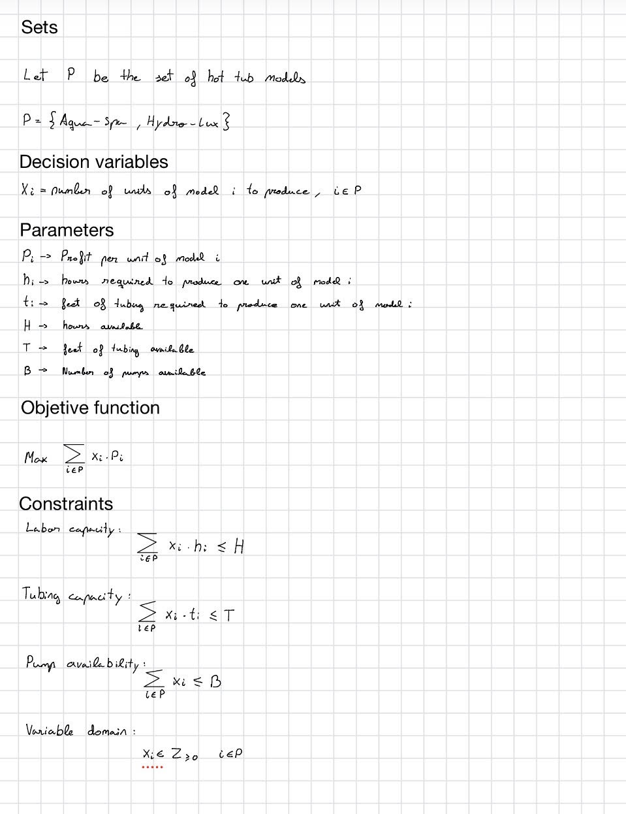

## Problem Description

Blue Ridge Hot Tubs manufactures two hot tub models: **Aqua-Spa** and **Hydro-Lux**. Each product generates a different profit and requires different amounts of labor and fiberglass tubing during the manufacturing process. In addition, every hot tub requires one pump, and the company has a limited number of pumps available.

The objective is to determine the optimal production quantities of each model in order to **maximize the total profit** while respecting the available labor hours, tubing, and pump capacities.

## Data

### Products

| Product   | Profit ($/unit) | Labor (hours/unit) | Tubing (ft/unit) | Pumps |
| --------- | --------------: | -----------------: | ---------------: | ----: |
| Aqua-Spa  |             350 |                  9 |               12 |     1 |
| Hydro-Lux |             300 |                  6 |               16 |     1 |

### Available Resources

| Resource               | Available |
| ---------------------- | --------: |
| Labor hours            |      1566 |
| Fiberglass tubing (ft) |      2880 |
| Pumps                  |       200 |

## Mathematical formulation

## Results

Optimal solution:

| Variable | Value |
|----------|------:|
| Aqua-Spa | 122 |
| Hydro-Lux | 78 |

Optimal profit:

$66100

Constraints slack:

| Constraint | Value |
|----------|------:|
| labor_capacity | 0.0 |
| tubing_capacity | 168.0 |
| pump_availability | 0.0 |

The analysis of the constraint slack shows that labor capacity and pump availability are binding constraints, as both have zero slack. This means that these resources are fully utilized and are the limiting factors in the production plan. In contrast, the tubing constraint has a slack of 168 feet, indicating that some tubing remains unused and is therefore not a limiting resource.