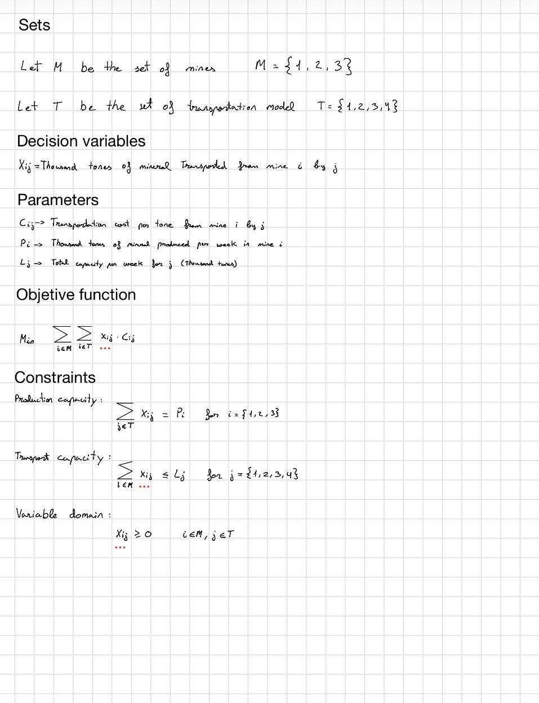

## Problem Description

An aluminum factory receives bauxite from **three different mines**. The extracted mineral can be transported to the factory using **four transportation modes**, each with a limited transportation capacity and a different transportation cost depending on the mine.

The objective is to determine how much material should be transported from each mine using each transportation mode in order to **minimize the total transportation cost**, while ensuring that all the available production from every mine is delivered to the factory without exceeding the transportation capacities.

For consistency, all quantities are assumed to be expressed in thousand tonnes per week.

## Data

### Mine Production

| Mine | Weekly Production (1000 tons) |
| ---- | ----------------------------: |
| 1    |                             3 |
| 2    |                             7 |
| 3    |                             5 |

### Transportation Capacity

| Transportation Mode        | Capacity (1000 tons) |
| -------------------------- | -------------------: |
| T1 (Ship)                  |                    4 |
| T2 (Truck)                 |                    3 |
| T3 (Railway Wagon)         |                    4 |
| T4 (Special Railway Wagon) |                    4 |

### Transportation Costs

| Mine | T1 | T2 | T3 | T4 |
| ---- | -: | -: | -: | -: |
| 1    |  2 |  2 |  2 |  1 |
| 2    | 10 |  8 |  5 |  4 |
| 3    |  7 |  6 |  6 |  8 |

## Mathematical formulation

## Results

Optimal transportation plan:

| Mine | Type1 | Type2 | Type3 | Type4 |
|------|------:|------:|------:|------:|
| Mine1 | 3 | 0 | 0 | 0 |
| Mine2 | 0 | 0 | 3 | 4 |
| Mine3 | 1 | 3 | 1 | 0 |

Optimal transportation cost:

$68

## Conclusion

All production constraints are satisfied exactly, meaning that no mine production is left untransported. In addition, all transportation capacity constraints are binding, which indicates that the total available transport capacity is exactly equal to the total amount of material that must be shipped.
