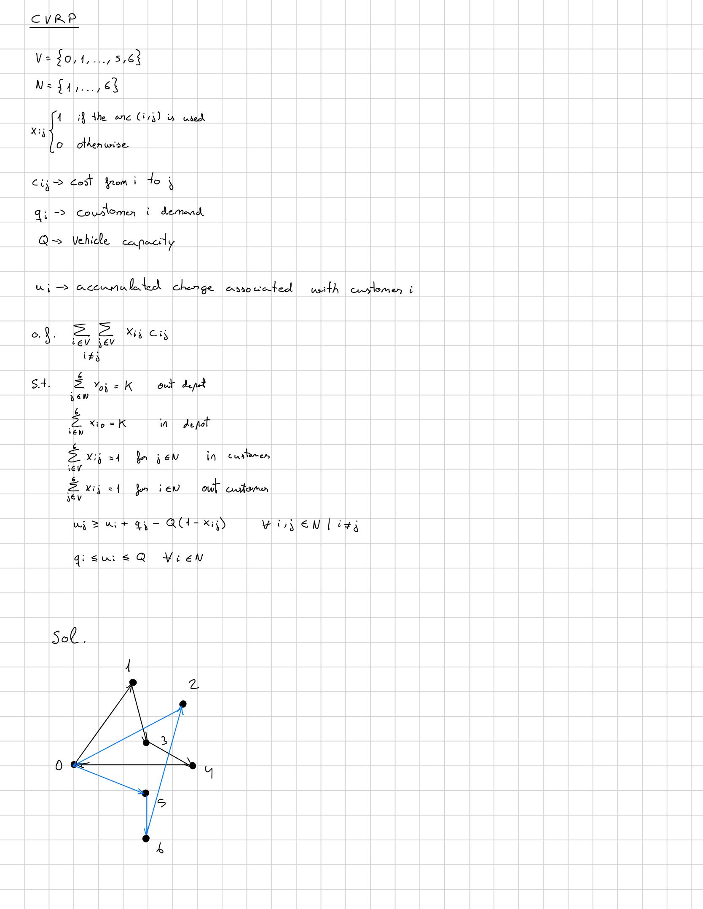

# Capacitated Vehicle Routing Problem (CVRP)

## Overview

The **Capacitated Vehicle Routing Problem (CVRP)** is an extension of the **Vehicle Routing Problem (VRP)** in which each customer has a known demand and each vehicle has a limited carrying capacity.

The objective is to determine a set of minimum-cost routes for a fleet of vehicles that serve a set of customers from a common depot. Each customer must be visited exactly once, every route must start and end at the depot, and the total demand served by each vehicle cannot exceed its maximum capacity.

The CVRP therefore extends the VRP by introducing:

- A demand \(q_i\) for each customer.
- A maximum vehicle capacity \(Q\).
- Auxiliary load variables to track the accumulated demand along each route.

In this project, the CVRP is implemented using:

- **lp_solve** with GNU MathProg.
- **Gurobi Optimizer** with the Python API.

Both the linear relaxation and the complete integer formulation are considered.

The purpose of this implementation is to understand how capacity constraints can be incorporated into the basic VRP formulation before introducing time-related constraints in the **Capacitated Vehicle Routing Problem with Time Windows (CVRPTW)**.

---

## Mathematical Formulation

The mathematical formulation used in this project is shown below.

  

The vehicles are assumed to be homogeneous. Therefore, individual vehicles are not explicitly indexed in the decision variables.

---

## Subtour Elimination

In the basic VRP formulation, additional subtour elimination constraints were required to prevent cycles involving only customers and disconnected from the depot.

In the CVRP formulation used here, the accumulated load constraints also prevent these customer-only subtours when all customer demands are strictly positive.

Therefore, the load propagation constraints simultaneously:

- Enforce vehicle capacity.
- Prevent customer-only subtours.

This avoids the need to manually add the subtour elimination constraints used in the previous VRP implementation.

---

## Example Instances

Two illustrative instances are used to test the CVRP formulation.

### Instance 1: 6 Customers

The first instance consists of:

- **1 depot**: node 0.
- **6 customers**: nodes 1 to 6.
- **2 vehicles**.
- **Vehicle capacity**: \(Q=8\).

The customer demands are:

| Customer | Demand |
|---:|---:|
| 1 | 2 |
| 2 | 3 |
| 3 | 2 |
| 4 | 4 |
| 5 | 2 |
| 6 | 3 |

---

### Instance 2: 10 Customers

A larger instance is also considered with:

- **1 depot**: node 0.
- **10 customers**: nodes 1 to 10.
- **3 vehicles**.
- **Vehicle capacity**: \(Q=10\).

The customer demands are:

| Customer | Demand |
|---:|---:|
| 1 | 2 |
| 2 | 3 |
| 3 | 2 |
| 4 | 4 |
| 5 | 2 |
| 6 | 3 |
| 7 | 1 |
| 8 | 2 |
| 9 | 3 |
| 10 | 2 |

---

## Implementation

The same mathematical formulation is implemented using two optimization environments.

### lp_solve

The lp_solve implementation uses the **XLI_MathProg** interface and GNU MathProg syntax.

The implementation includes:

- Binary routing variables for the complete CVRP.
- Continuous accumulated load variables.
- Depot constraints.
- Customer degree constraints.
- Vehicle capacity and load propagation constraints.

The bounds of the accumulated load variables can be directly included in their declaration.

This avoids introducing separate constraints for their lower and upper bounds.

### Gurobi

The Gurobi implementation uses the **gurobipy** Python API.

The same sets, parameters, variables, objective function, degree constraints, and capacity constraints are used, allowing a direct comparison with the lp_solve implementation.

The experiments also illustrate differences in computational performance between both optimization environments for the same CVRP formulation.

---

## Repository Structure

CVRP/
│
├── cvrp_6.mod
├── cvrp_6.py
├── cvrp_10.mod
├── cvrp_10.py
├── mat_model.jpg
└── README.md

### Files

- `cvrp_6.mod` — 6-customer CVRP instance implemented with lp_solve/XLI_MathProg.
- `cvrp_6.py` — 6-customer CVRP instance implemented with Gurobi.
- `cvrp_10.mod` — 10-customer CVRP instance implemented with lp_solve/XLI_MathProg.
- `cvrp_10.py` — 10-customer CVRP instance implemented with Gurobi.
- `mat_model.jpg` — Mathematical formulation of the CVRP.
- `README.md` — Description of the problem, formulation, implementations, and experiments.

---

## From VRP to CVRP

The CVRP extends the basic VRP by introducing customer demands and vehicle capacities.

### VRP

The VRP determines multiple routes that:

- Start at the depot.
- Visit every customer exactly once.
- Return to the depot.

### CVRP

The CVRP maintains these requirements and additionally imposes vehicle capacity and load propagation constraints

| Problem | Main feature |
|---|---|
| TSP | Single route |
| VRP | Multiple routes and depot |
| CVRP | Vehicle capacity and customer demand |
| CVRPTW | Capacity and time windows |

The next step, the **CVRPTW**, will introduce temporal restrictions specifying when each customer can be served.

---

## Learning Objectives

The objectives of this implementation are to:

- Understand the transition from the VRP to the CVRP.
- Introduce customer demands and vehicle capacities.
- Understand the role of accumulated load variables.
- Propagate vehicle load through selected routing arcs.
- Ensure that the capacity of each vehicle is not exceeded.
- Understand how load propagation constraints can also eliminate customer-only subtours.
- Compare the LP relaxation with the integer formulation.
- Compare the same mathematical formulation using lp_solve and Gurobi.
- Study the computational differences observed between both solvers.
- Establish the mathematical foundations required for the CVRPTW.

---

## Technologies

- **Python**
- **Gurobi Optimizer**
- **lp_solve**
- **GNU MathProg**