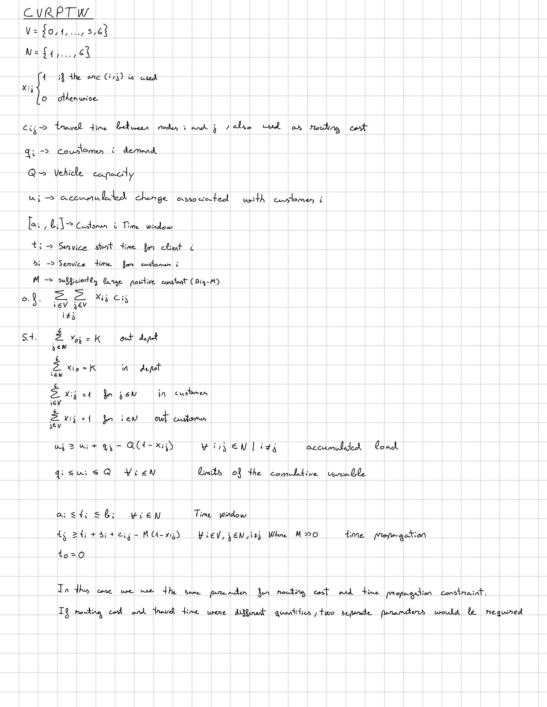

# Capacitated Vehicle Routing Problem with Time Windows (CVRPTW)

## Overview

The **Capacitated Vehicle Routing Problem with Time Windows (CVRPTW)** is an extension of the **Capacitated Vehicle Routing Problem (CVRP)** in which each customer must be served within a predefined time window.

The objective is to determine a set of minimum-cost routes for a fleet of capacitated vehicles that serve a set of customers from a common depot.

Each customer must be visited exactly once, every route must start and end at the depot, the total demand assigned to each route cannot exceed the vehicle capacity, and service at each customer must begin within its corresponding time window.

The CVRPTW therefore extends the CVRP by introducing:

- A time window \([a_i,b_i]\) for each customer.
- A service time \(s_i\) at each node.
- A service start time variable \(t_i\).
- Time propagation constraints between consecutive nodes.
- A Big-M parameter used to activate the temporal relationship only when an arc is selected.

In this project, the CVRPTW is implemented using:

- **lp_solve** with GNU MathProg.
- **Gurobi Optimizer** with the Python API.

The CVRPTW represents the final step in the sequence of routing models developed in this project:


TSP -> VRP -> CVRP -> CVRPTW


---

## Mathematical Formulation

The mathematical formulation used in this project is shown below.

<p align="center">
  
</p>

The formulation uses three main types of decision variables:

- \(x_{ij}\): indicates whether the arc from node \(i\) to node \(j\) is used.
- \(u_i\): represents the accumulated vehicle load associated with customer \(i\).
- \(t_i\): represents the service start time at node \(i\).

The vehicles are assumed to be homogeneous. Therefore, individual vehicles are not explicitly indexed in the decision variables.

---

## Time Window Constraints

Each customer \(i\) has a time window:


[a_i,b_i]


where:

- \(a_i\) is the earliest possible service start time.
- \(b_i\) is the latest possible service start time.


The depot departure time is fixed as:


t_0=0


and the service time at the depot is defined as:


s_0=0

---

## Time Propagation

If a vehicle travels directly from node \(i\) to customer \(j\), service at customer \(j\) cannot begin until service at node \(i\) has finished and the vehicle has completed the corresponding journey.


- \(t_i\) is the service start time at node \(i\).
- \(s_i\) is the service duration at node \(i\).
- \(c_{ij}\) is the travel time from node \(i\) to node \(j\).
- \(M\) is a sufficiently large positive constant.

If:


x_{ij}=1


the constraint becomes:


t_j >= t_i+s_i+c_{ij}


and therefore enforces temporal consistency along the selected route.

If:


x_{ij}=0


the Big-M term relaxes the constraint.

The formulation also includes arcs leaving the depot. Therefore, the service time of the first customer of each route is correctly related to the departure time from the depot.

The destination index is restricted to customers, so the same time propagation constraint is not applied to arcs returning to the depot. The variable \(t_0\) represents the common departure reference time and does not represent the different return times of the individual vehicles.

---

## Travel Time as Routing Cost

In this formulation, the parameter:


c_{ij}


represents the **travel time** from node \(i\) to node \(j\).

Travel time is also used as the routing cost in the objective function. Therefore, the objective minimizes the total travel time.

This avoids introducing a separate travel-time parameter.

If travel time and routing cost represented different quantities in a different application, two separate parameters would be required.

---

## Big-M

The time propagation constraints use a Big-M parameter:


M


which must be sufficiently large to deactivate the temporal relationship when an arc is not selected.

For the illustrative instances used in this project:


M=100


is used as a sufficiently large value relative to the considered time windows and travel times.

However, excessively large Big-M values can weaken the linear relaxation and may lead to numerical or computational difficulties.

A tighter arc-dependent value can be obtained from the time-window bounds. For example:


M_{ij}>= b_i+s_i+c_{ij}-a_j


This provides a possible improvement over the single global Big-M value used in the illustrative implementation.

---

## Example Instances

Two illustrative instances are used to test the CVRPTW formulation.

### Instance 1: 6 Customers

The first instance consists of:

- **1 depot**: node 0.
- **6 customers**: nodes 1 to 6.
- **2 vehicles**.
- **Vehicle capacity**: \(Q=8\).
- **Big-M**: \(M=100\).

The customer demands are:

| Customer | Demand |
|---:|---:|
| 1 | 2 |
| 2 | 3 |
| 3 | 2 |
| 4 | 4 |
| 5 | 2 |
| 6 | 3 |

The time windows are:

| Customer | Earliest time | Latest time |
|---:|---:|---:|
| 1 | 3 | 6 |
| 2 | 4 | 7 |
| 3 | 8 | 11 |
| 4 | 13 | 16 |
| 5 | 18 | 22 |
| 6 | 15 | 19 |

A service time of 2 time units is used for every customer, while the service time at the depot is 0.

The optimal solution obtained with Gurobi has a total travel time of:

40

with the routes:


0-> 1 -> 4 -> 5 -> 0

0-> 2 -> 3 -> 6 -> 0


The corresponding route loads are:


2+4+2=8

and:

3+2+3=8


so both routes satisfy:


route load <= Q


The service start times obtained are:

| Node | Service start time |
|---:|---:|
| 0 | 0 |
| 1 | 3 |
| 2 | 4 |
| 3 | 9 |
| 4 | 16 |
| 5 | 22 |
| 6 | 19 |

All customer service start times satisfy their corresponding time windows.

---

### Instance 2: 10 Customers

A second, larger instance is considered with:

- **1 depot**: node 0.
- **10 customers**: nodes 1 to 10.
- **3 vehicles**.
- **Vehicle capacity**: \(Q=10\).
- **Big-M**: \(M=100\).


The optimal solution obtained has a total travel time of:

45

with the routes:


0 -> 1 -> 2 -> 3 -> 0


0 -> 4 -> 5 -> 6 -> 0


0 -> 8 -> 9 -> 10 -> 7 -> 0


Their respective route loads are:


2+3+2=7

4+2+3=9

and:

2+3+2+1=8


and therefore all routes satisfy the maximum vehicle capacity \(Q=10\).

The solution also satisfies all customer time windows and time propagation constraints.

---

## Implementation

The same mathematical formulation is implemented using two optimization environments:

- **lp_solve**, using the XLI_MathProg interface and GNU MathProg syntax.
- **Gurobi Optimizer**, using the `gurobipy` Python API.

Two instances are considered to compare the behavior of the formulation as the number of customers increases.

### lp_solve

The lp_solve implementation includes:

- Binary routing variables.
- Continuous accumulated load variables.
- Continuous service start time variables.
- Depot constraints.
- Customer degree constraints.
- Capacity and load propagation constraints.
- Customer time-window constraints.
- Time propagation constraints using Big-M.

### Gurobi

The Gurobi implementation follows the same mathematical formulation and uses the same problem data.

This allows the solutions obtained with both optimization environments to be compared directly.

---

## Repository Structure

```text
CVRPTW/
│
├── cvrptw_6.mod
├── cvrptw_6.py
├── cvrptw_10.mod
├── cvrptw_10.py
├── mat_model.jpg
└── README.md
```

### Files

- `cvrptw_6.mod` — 6-customer CVRPTW instance implemented with lp_solve/XLI_MathProg.
- `cvrptw_6.py` — 6-customer CVRPTW instance implemented with Gurobi.
- `cvrptw_10.mod` — 10-customer CVRPTW instance implemented with lp_solve/XLI_MathProg.
- `cvrptw_10.py` — 10-customer CVRPTW instance implemented with Gurobi.
- `mat_model.jpg` — Mathematical formulation of the CVRPTW.
- `README.md` — Description of the problem, formulation, implementations, and experiments.

---

## From TSP to CVRPTW

The sequence of models developed in this project progressively introduces the main characteristics of vehicle routing problems.

### TSP

The Traveling Salesman Problem determines a single minimum-cost tour visiting every node exactly once.

### VRP

The Vehicle Routing Problem extends the TSP by introducing a depot and multiple vehicle routes.

### CVRP

The Capacitated Vehicle Routing Problem introduces:

- Customer demands.
- Vehicle capacity.
- Accumulated load variables.

### CVRPTW

The Capacitated Vehicle Routing Problem with Time Windows additionally introduces:

- Customer time windows.
- Service durations.
- Service start time variables.
- Temporal propagation between consecutive nodes.

The complete progression is therefore:


| Problem | Main characteristics |
|---|---|
| TSP | Single tour |
| VRP | Multiple routes and common depot |
| CVRP | Customer demand and vehicle capacity |
| CVRPTW | Capacity, service times and time windows |

---

## Learning Objectives

The objectives of this implementation are to:

- Understand the transition from the CVRP to the CVRPTW.
- Introduce customer time windows into a vehicle routing formulation.
- Model service start times using continuous auxiliary variables.
- Understand the difference between travel time, service time, and waiting time.
- Propagate time between consecutive nodes.
- Understand the role of Big-M in conditional routing constraints.
- Combine capacity and temporal restrictions in the same routing model.
- Understand how accumulated load constraints prevent customer-only subtours.
- Verify route feasibility with respect to both capacity and time.
- Implement the same mathematical formulation using lp_solve and Gurobi.
- Compare the computational behavior observed with both optimization environments.
- Complete the progression from TSP to CVRPTW.

---

## Technologies

- **Python**
- **Gurobi Optimizer**
- **lp_solve**
- **GNU MathProg**