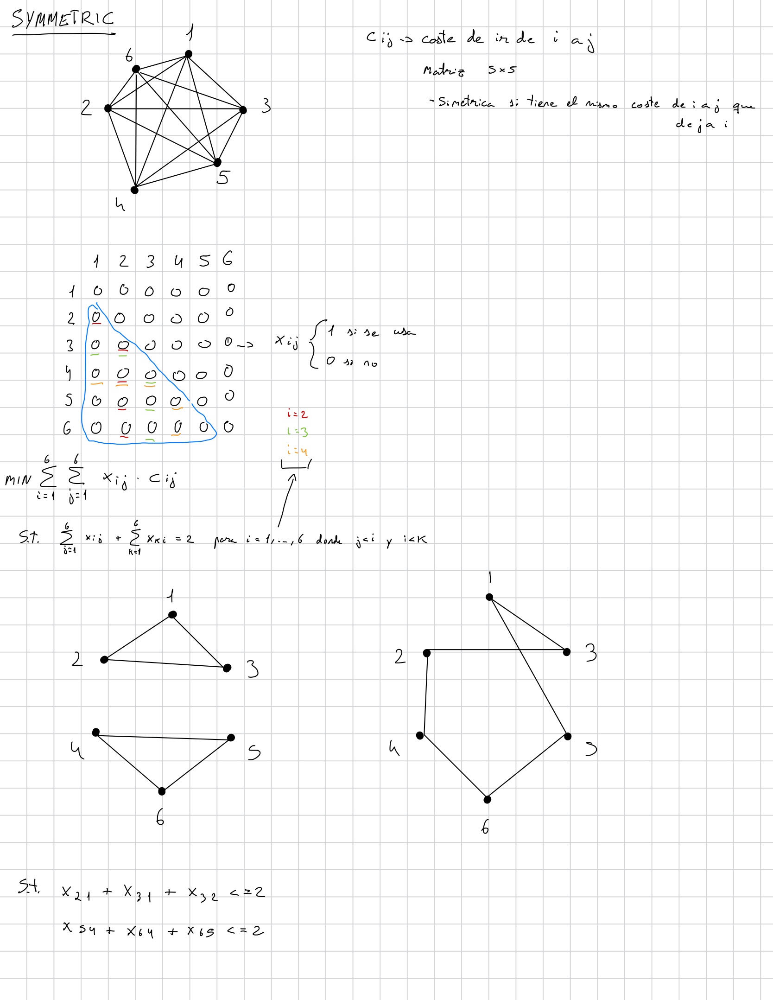
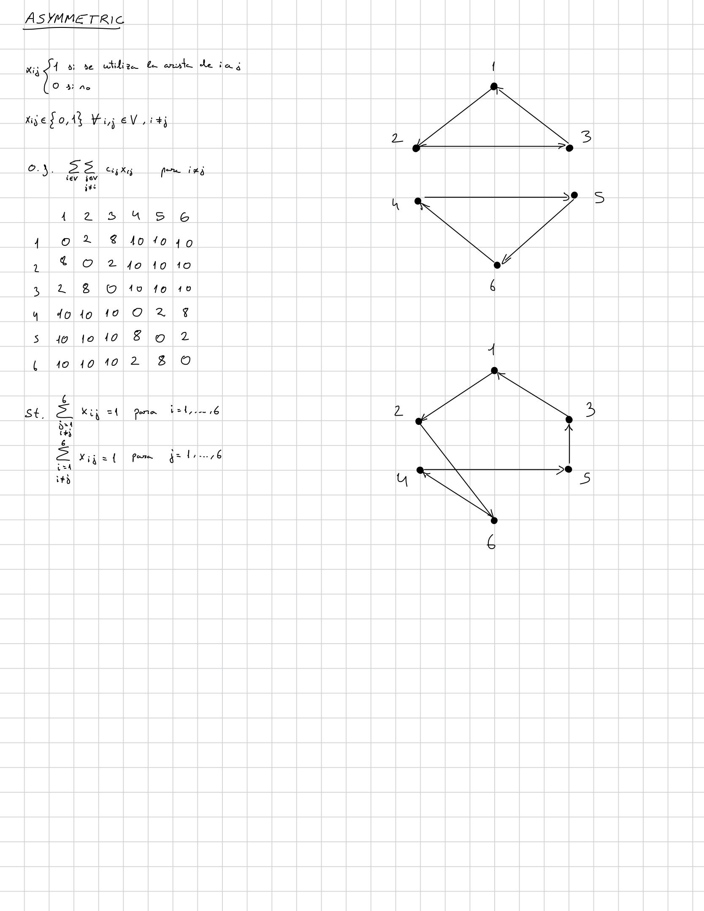

# Traveling Salesman Problem (TSP)

## Overview

The **Traveling Salesman Problem (TSP)** is one of the most fundamental combinatorial optimization problems in operations research.

The objective is to determine a minimum-cost tour that visits every city exactly once and returns to the starting city.

In this project, two variants of the TSP are considered:

- **Symmetric Traveling Salesman Problem (STSP)**
- **Asymmetric Traveling Salesman Problem (ATSP)**

Both formulations are implemented using:

- **lp_solve** with GNU MathProg.
- **Gurobi Optimizer** with the Python API.

For each variant, both the linear relaxation and the complete integer formulation with subtour elimination constraints are studied.

The purpose of these implementations is to understand the mathematical foundations of routing problems before extending the formulation to the **Vehicle Routing Problem (VRP)**, the **Capacitated Vehicle Routing Problem (CVRP)**, and the **Capacitated Vehicle Routing Problem with Time Windows (CVRPTW)**.

---

## Problem Variants

### Symmetric Traveling Salesman Problem

In the **Symmetric Traveling Salesman Problem (STSP)**, the travel cost between two cities is the same in both directions.

Therefore, the transportation network can be represented as an **undirected graph**.

Only one decision variable is required for each pair of cities, since traveling between \(i\) and \(j\) represents the same edge regardless of direction.


---

### Asymmetric Traveling Salesman Problem

In the **Asymmetric Traveling Salesman Problem (ATSP)**, the travel cost may depend on the direction:

Therefore, the transportation network is represented as a **directed graph**.

This formulation can represent situations where transportation costs depend on direction, such as one-way streets, traffic conditions, slopes, or different travel times.

---

## Mathematical Formulation

### Symmetric TSP

The mathematical formulation used for the symmetric problem is shown below.

<p align="center">
  
</p>

In the symmetric formulation, the binary decision variable represents whether an undirected edge between two cities is selected.

Each city must have exactly two incident selected edges.

---

### Asymmetric TSP

The mathematical formulation used for the asymmetric problem is shown below.

<p align="center">
  
</p>

In the asymmetric formulation, the decision variables represent directed arcs.

Each city must therefore have:

- Exactly one outgoing arc.
- Exactly one incoming arc.

---

## Linear Relaxation

Before solving the complete integer formulations, the linear relaxations of both TSP variants are considered.


This allows the behavior of the LP relaxation to be studied before enforcing integrality.

The comparison between the relaxed and integer formulations helps illustrate the role of integrality and subtour elimination constraints in routing problems.

---

## Example Instance

Small illustrative instances with **6 cities** are used to study both formulations.

The instances are intentionally designed so that the initial degree-constrained models generate disconnected cycles.

This makes it possible to:

- Inspect the solution manually.
- Identify subtours.
- Add the corresponding subtour elimination constraints.
- Solve the model again.
- Compare the behavior of the symmetric and asymmetric formulations.

---

## Subtour Elimination

Degree constraints alone do not guarantee that the selected edges or arcs form a single Hamiltonian cycle.

The model may instead generate several disconnected cycles known as **subtours**.


## Implementation

Both TSP variants are implemented using the same two optimization environments.

### Symmetric Problem

The `Symmetric_problem` directory contains four implementations:

- `Relax_lpsolve.mod`: linear relaxation implemented with lp_solve/XLI_MathProg.
- `Relax_gurobi.py`: linear relaxation implemented with Gurobi.
- `Subtours_lpsolve.mod`: integer formulation with subtour elimination constraints implemented with lp_solve/XLI_MathProg.
- `Subtours_gurobi.py`: integer formulation with subtour elimination constraints implemented with Gurobi.

Because the problem is symmetric, only one variable is created for each pair of cities.

---

### Asymmetric Problem

The `Asymmetric_problem` directory contains the equivalent four implementations:

- `Relax_lpsolve.mod`: linear relaxation implemented with lp_solve/XLI_MathProg.
- `Relax_gurobi.py`: linear relaxation implemented with Gurobi.
- `Subtours_lpsolve.mod`: integer formulation with subtour elimination constraints implemented with lp_solve/XLI_MathProg.
- `Subtours_gurobi.py`: integer formulation with subtour elimination constraints implemented with Gurobi.

In this case, both directions between two different cities are explicitly represented.

---

## Repository Structure

```text
TSP/
│
├── Asymmetric_problem/
│   ├── Relax_gurobi.py
│   ├── Relax_lpsolve.mod
│   ├── Subtours_gurobi.py
│   └── Subtours_lpsolve.mod
│
├── Symmetric_problem/
│   ├── Relax_gurobi.py
│   ├── Relax_lpsolve.mod
│   ├── Subtours_gurobi.py
│   └── Subtours_lpsolve.mod
│
├── mat_model_asym.jpg
├── mat_model_sym.jpg
└── README.md
```

### Files

- `mat_model_sym.jpg` — Mathematical formulation of the symmetric TSP.
- `mat_model_asym.jpg` — Mathematical formulation of the asymmetric TSP.
- `Relax_gurobi.py` — Linear relaxation implemented with Gurobi.
- `Relax_lpsolve.mod` — Linear relaxation implemented with lp_solve/XLI_MathProg.
- `Subtours_gurobi.py` — Integer formulation with manually added subtour elimination constraints implemented with Gurobi.
- `Subtours_lpsolve.mod` — Integer formulation with manually added subtour elimination constraints implemented with lp_solve/XLI_MathProg.

---

## From TSP to VRP

The TSP provides the mathematical foundation for more general vehicle routing problems.


The main difference between the TSP and the VRP is the number of routes.

In the TSP, all cities belong to a **single tour**.

In the VRP, multiple routes depart from and return to a common depot while collectively serving all customers.

Further extensions introduce additional operational constraints:

| Problem | Main feature |
|---|---|
| TSP | Single route |
| VRP | Multiple routes and depot |
| CVRP | Vehicle capacity and customer demand |
| CVRPTW | Capacity and time windows |

---

## Learning Objectives

The objectives of this implementation are to:

- Understand the mathematical formulation of the Traveling Salesman Problem.
- Compare symmetric and asymmetric TSP formulations.
- Understand the difference between undirected edges and directed arcs.
- Understand degree constraints in both formulations.
- Identify disconnected subtours.
- Understand and apply subtour elimination constraints.
- Compare LP relaxations with integer formulations.
- Implement the same optimization problems using lp_solve and Gurobi.
- Establish the mathematical foundations required for the VRP, CVRP, and CVRPTW.

---

## Technologies

- **Python**
- **Gurobi Optimizer**
- **lp_solve**
- **GNU MathProg**