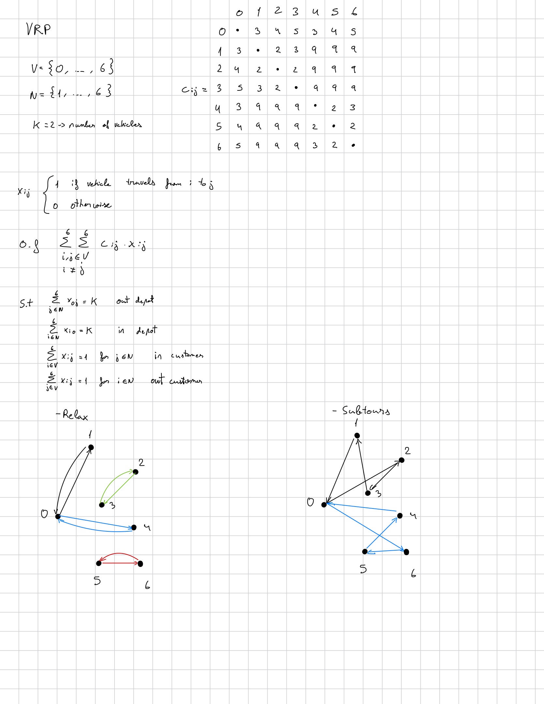

# Vehicle Routing Problem (VRP)

## Overview

The **Vehicle Routing Problem (VRP)** is a fundamental combinatorial optimization problem in transportation and logistics.

The objective is to determine a set of minimum-cost routes for a fleet of vehicles that serve a set of customers from a common depot. Each customer must be visited exactly once, and every route must start and end at the depot.

The VRP can be viewed as an extension of the **Traveling Salesman Problem (TSP)**. While the TSP searches for a single tour visiting all nodes, the VRP allows multiple routes associated with a fleet of vehicles.

In this project, the VRP is implemented using:

- **lp_solve** with GNU MathProg.
- **Gurobi Optimizer** with the Python API.

The purpose of this implementation is to understand the transition from the TSP to vehicle routing models before introducing additional constraints in the **Capacitated Vehicle Routing Problem (CVRP)** and the **Capacitated Vehicle Routing Problem with Time Windows (CVRPTW)**.

---

## Problem Definition

Let:

- \(V = \{0,1,\dots,n\}\) be the set of nodes.
- \(N = \{1,\dots,n\}\) be the set of customers.
- Node \(0\) represent the depot.
- \(k\) be the number of vehicles.
- \(c_{ij}\) be the cost of traveling from node \(i\) to node \(j\).

The objective is to construct \(k\) routes such that:

- Every route starts at the depot.
- Every route returns to the depot.
- Every customer is visited exactly once.
- Subtours disconnected from the depot are not allowed.
- The total routing cost is minimized.

The vehicles are assumed to be **homogeneous**. Therefore, individual vehicles are not explicitly indexed in the decision variables.

---

## Mathematical Formulation

The mathematical formulation used in this project is shown below.

<p align="center">
  
</p>

### Decision Variables

A binary decision variable is defined for every possible directed arc between two different nodes:

\[
x_{ij} =
\begin{cases}
1 & \text{if the arc from node } i \text{ to node } j \text{ is used} \\
0 & \text{otherwise}
\end{cases}
\]

for:

\[
i,j\in V, \qquad i\neq j
\]

Since the vehicles are homogeneous, the model does not need to explicitly identify which vehicle travels through each arc.

---

### Objective Function

The objective is to minimize the total transportation cost:

\[
\min
\sum_{i\in V}
\sum_{\substack{j\in V\\j\neq i}}
c_{ij}x_{ij}
\]

---

### Depot Constraints

Exactly \(k\) routes must leave the depot:

\[
\sum_{j\in N}x_{0j}=k
\]

and exactly \(k\) routes must return to the depot:

\[
\sum_{i\in N}x_{i0}=k
\]

These constraints represent the use of \(k\) vehicles without explicitly assigning an index to each vehicle.

---

### Customer Degree Constraints

Each customer must have exactly one incoming arc:

\[
\sum_{\substack{i\in V\\i\neq j}}x_{ij}=1
\qquad
\forall j\in N
\]

and exactly one outgoing arc:

\[
\sum_{\substack{j\in V\\j\neq i}}x_{ij}=1
\qquad
\forall i\in N
\]

Together, these constraints ensure that every customer is visited exactly once.

---

## Subtour Elimination

The depot and customer degree constraints are not sufficient to guarantee valid vehicle routes.

For example, a solution may contain valid routes connected to the depot together with cycles involving only customers:

\[
0\rightarrow1\rightarrow0
\]

\[
0\rightarrow4\rightarrow0
\]

while simultaneously containing:

\[
2\rightarrow3\rightarrow2
\]

\[
5\rightarrow6\rightarrow5
\]

Although every customer has exactly one incoming and one outgoing arc, the last two cycles are disconnected from the depot and therefore do not represent valid vehicle routes.

These cycles are known as **subtours**.

For a subset of customers \(S\subseteq N\), a subtour elimination constraint (SEC) can be expressed as:

\[
\sum_{\substack{i,j\in S\\i\neq j}}x_{ij}
\leq |S|-1
\]

For example, for:

\[
S=\{2,3\}
\]

the corresponding constraint is:

\[
x_{23}+x_{32}\leq1
\]

Similarly, for:

\[
S=\{1,2,3\}
\]

the constraint becomes:

\[
x_{12}+x_{13}
+x_{21}+x_{23}
+x_{31}+x_{32}
\leq2
\]

In the small example used in this project, violated subtour constraints are identified and added manually. This illustrates the principle behind iterative subtour elimination:

1. Solve the optimization model.
2. Identify disconnected subtours.
3. Add the corresponding subtour elimination constraints.
4. Solve the model again.
5. Repeat until all routes are connected to the depot.

For larger instances, this procedure should be automated through systematic constraint generation or callback-based approaches.

---

## Linear Relaxation

Before solving the complete integer model, the linear relaxation is also considered.

The original binary condition:

\[
x_{ij}\in\{0,1\}
\]

is replaced by:

\[
0\leq x_{ij}\leq1
\]

This allows the behavior of the LP relaxation to be studied before enforcing integrality.

The comparison between the relaxed and integer formulations is useful for understanding the role of binary decision variables in routing problems.

---

## Example Instance

A small illustrative instance is used to test the formulation.

The instance consists of:

- **1 depot**: node 0.
- **6 customers**: nodes 1 to 6.
- **2 vehicles**.

The cost matrix is:

| From / To | 0 | 1 | 2 | 3 | 4 | 5 | 6 |
|---:|---:|---:|---:|---:|---:|---:|---:|
| **0** | - | 3 | 4 | 5 | 3 | 4 | 5 |
| **1** | 3 | - | 2 | 3 | 9 | 9 | 9 |
| **2** | 4 | 2 | - | 2 | 9 | 9 | 9 |
| **3** | 5 | 3 | 2 | - | 9 | 9 | 9 |
| **4** | 3 | 9 | 9 | 9 | - | 2 | 3 |
| **5** | 4 | 9 | 9 | 9 | 2 | - | 2 |
| **6** | 5 | 9 | 9 | 9 | 3 | 2 | - |

The small size of the instance makes it possible to manually inspect the solution and identify disconnected subtours.

For example, before adding the necessary subtour elimination constraints, solutions such as:

\[
0\rightarrow1\rightarrow0
\]

\[
0\rightarrow4\rightarrow0
\]

\[
2\rightarrow3\rightarrow2
\]

\[
5\rightarrow6\rightarrow5
\]

may appear.

After adding the corresponding SECs, new subtours may still appear. For example:

\[
1\rightarrow3\rightarrow2\rightarrow1
\]

This demonstrates why eliminating only a particular observed cycle is not sufficient in the general case and motivates the general SEC formulation.

---

## Implementation

The same mathematical model is implemented using two optimization environments.

### lp_solve

The lp_solve implementation uses the **XLI_MathProg** interface and GNU MathProg syntax.

The implementation includes:

- Continuous LP relaxation.
- Binary decision variables for the complete model.
- Depot constraints.
- Customer degree constraints.
- Manual subtour elimination constraints.

### Gurobi

The Gurobi implementation uses the **gurobipy** Python API.

The implementation follows the same structure as the lp_solve model, allowing the results obtained with both solvers to be compared directly.

---

## Repository Structure

```text
VRP/
│
├── README.md
│
├── images/
│   └── vrp_mathematical_model.png
│
├── lp_solve/
│   └── vrp.mod
│
└── gurobi/
    └── vrp.py
```

---

## From TSP to VRP

The VRP extends the Traveling Salesman Problem by introducing multiple routes originating from a common depot.

### TSP

The TSP searches for a single tour:

\[
0\rightarrow \cdots \rightarrow0
\]

Every node belongs to the same route.

### VRP

The VRP allows \(k\) different routes:

\[
0\rightarrow \cdots \rightarrow0
\]

\[
0\rightarrow \cdots \rightarrow0
\]

\[
\vdots
\]

Each customer still has exactly one incoming and one outgoing arc, but the depot has \(k\) incoming and \(k\) outgoing arcs.

This is the main structural difference between the TSP and the basic VRP formulation considered here.

---

## From VRP to CVRP

The VRP developed in this section does not yet consider vehicle capacities or customer demands.

The next extension is the **Capacitated Vehicle Routing Problem (CVRP)**.

For each customer \(i\), a demand \(q_i\) will be introduced, together with a vehicle capacity \(Q\).

The routes will then have to satisfy:

\[
\text{total demand served by each route}\leq Q
\]

Therefore, the progression followed in this project is:

\[
\boxed{
TSP
\rightarrow
VRP
\rightarrow
CVRP
\rightarrow
CVRPTW
}
\]

where each problem introduces an additional layer of complexity:

| Problem | Main feature |
|---|---|
| TSP | Single route |
| VRP | Multiple routes and depot |
| CVRP | Vehicle capacity and customer demand |
| CVRPTW | Capacity and time windows |

---

## Learning Objectives

The objectives of this implementation are to:

- Understand the transition from the TSP to the VRP.
- Model multiple routes originating from a common depot.
- Understand depot and customer degree constraints.
- Identify disconnected subtours.
- Understand and apply subtour elimination constraints.
- Compare the LP relaxation with the integer formulation.
- Implement the same mathematical model using lp_solve and Gurobi.
- Establish the mathematical foundations required for the CVRP and CVRPTW.

---

## Technologies

- **Python**
- **Gurobi Optimizer**
- **lp_solve**
- **GNU MathProg**